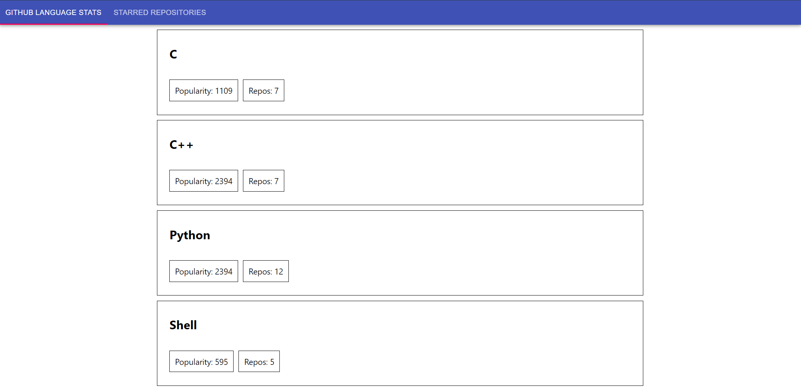

# Starred Repos 

[](https://facebook.github.io/react/)


The task is to implement a small web app that will list the most starred Github repos that were created in the last 30 days. You'll be fetching the 
sorted JSON data directly from the Github API.

## Installation

Use the package manager npm or yarn.

```bash
$ npm install
```
```bash
$ yarn install
```

## Page 1

- For every language, we need to calculate the attributes below:
  - Number of repos using this language
  - The list of repos using the language
  - Framework popularity over the 100 repositorie



## Page 2
- As a User I should be able to list the most starred Github repos that were created in the last 30 days.
- As a User I should see the results as a list. One repository per row.
- As a User I should be able to see for each repo/row the following details :
  - Repository name
  - Repository description
  - Number of stars for the repo.
  - Number of issues for the repo.
  - Username and avatar of the owner.
- As a User I should be able to keep scrolling and new results should appear (pagination).


